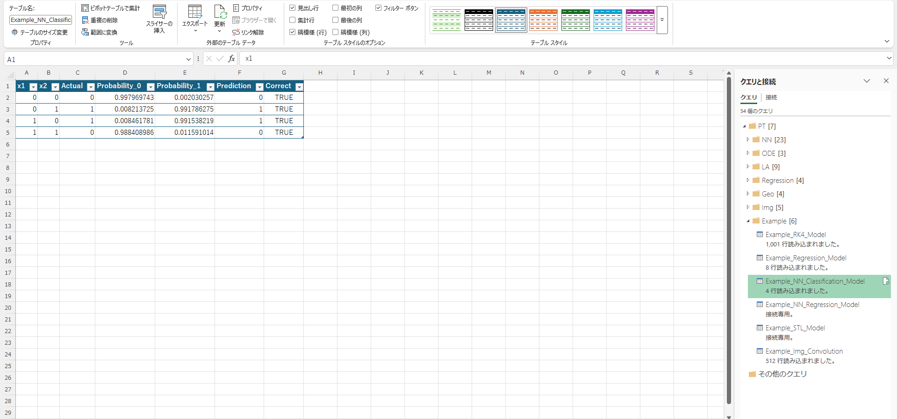
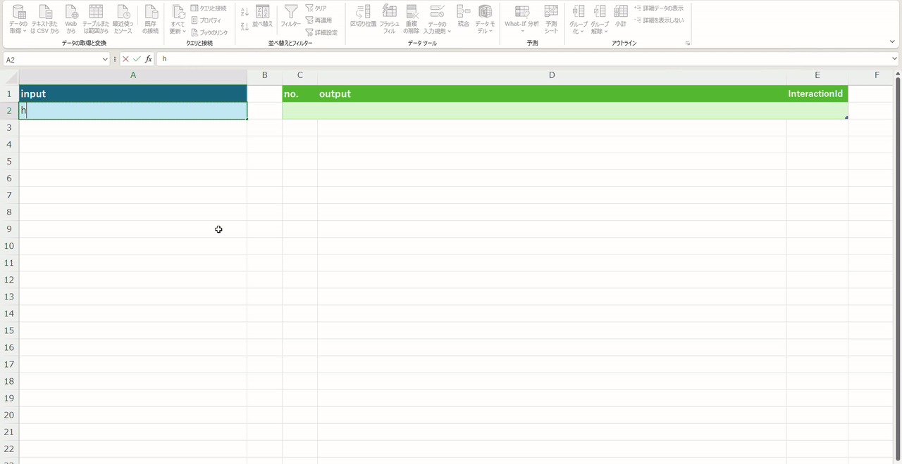
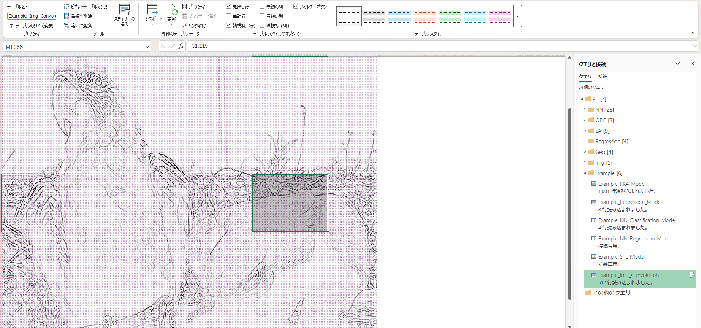
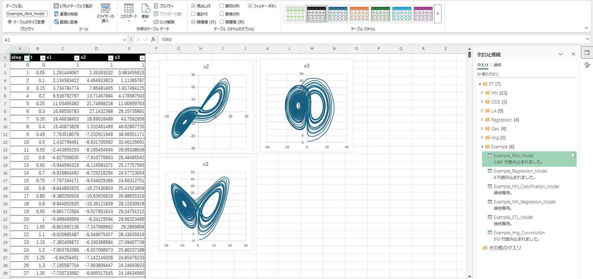

# 🌱Pukutochi

**Numerical computing, machine learning, geometry, image processing, and expression evaluation in Power Query (M).**
> **Power Query is a perfectly reasonable place for numerical computing.**

> 🇯🇵 **Power Queryは、数値計算を行うのに非常に適した環境です。**

Pukutochi（プクトーチ）は、Power Query / M language向けの数値計算・機械学習・3Dジオメトリ・画像処理・式評価ライブラリです。

Pukutochi provides reusable building blocks for:

* Linear algebra
* Regression
* Ordinary differential equations
* Neural networks
* Numerical optimization and machine learning
* 3D geometry and STL analysis
* Image processing
* Expression evaluation and API introspection

すべてPower Query / Mで実装されています。

|||
|---|---|
|||
|||


## 🔥PyTorch?

**No.**

Pukutochi is an independent open-source project and is not affiliated with, sponsored by, endorsed by, or otherwise associated with PyTorch or the PyTorch Foundation.

It is not a port, fork, wrapper, or reimplementation of PyTorch.

> 🇯🇵 PukutochiはPyTorchとは無関係の独立したOSSプロジェクトです。
>
> PyTorchの移植・フォーク・ラッパー・再実装ではありません。

The name is just the name.

> **Pukutochi is Pukutochi.**

---

## 🧮Features / 機能

### 📐Linear Algebra / 線形代数

Basic vector and matrix operations:

```
PT_LA_Dot
PT_LA_MatOp
PT_LA_MatVec
PT_LA_MatVecT
PT_LA_OuterProduct
PT_LA_Scale
PT_LA_Cholesky
PT_LA_ForwardSub
PT_LA_BackSub
```

Includes Cholesky decomposition and triangular system solvers.

---

### 📈Regression / 回帰

Linear regression using the normal equation and Cholesky decomposition.

```text id="ik2i7j"
PT_Regression_DesignMatrix
PT_Regression_NormalEquation
PT_Regression_LinearFit
PT_Regression_Predict
```

---

### ∫️ ODE / 常微分方程式

Fourth-order Runge-Kutta (RK4) solver.

```
PT_ODE_RK4Step
PT_ODE_RK4Solve
PT_ODE_RK4ToTable
```

The included example demonstrates the Lorenz system.

---

### 🧠 Neural Networks / ニューラルネットワーク

A lightweight neural network implementation in M.

Supported components include:

* Dense layers
* Forward propagation
* Backpropagation
* Gradient descent
* ReLU
* Tanh
* Softmax
* Mean Squared Error
* Cross Entropy
* Classification
* Regression

```
PT_NN_CreateLayer
PT_NN_Forward
PT_NN_Backward
PT_NN_TrainClassification
PT_NN_TrainRegression
```

---

### 🧊 3D Geometry / 3Dジオメトリ

Binary STL files can be read and analyzed directly in Power Query.

```
PT_Geo_ReadSTL
PT_Geo_AnalyzeMesh
PT_Geo_MeshToTable
PT_Geo_SampleCubeSTL
```

Current mesh analysis includes:

- Triangle count
- Vertex count
- Bounding box
- Width / Length / Height
- Surface area
- Volume

This can be combined with application-specific calculations such as:

```text
STL
 ↓
Mesh
 ↓
Geometry Analysis
 ↓
Volume
 ↓
Weight
 ↓
Material Cost
```

---

### 🖼️ Image Processing / 画像処理

Basic BMP image processing is supported directly in Power Query.

```text
PT_Img_ReadBMP
PT_Img_ToGray
PT_Img_Convolve
PT_Img_Clamp
PT_Img_ToTable
```

Supported BMP formats:

- 24-bit BMP
- 32-bit BMP

Current operations include:

- RGB pixel extraction
- Grayscale conversion
- 2D convolution
- Value clamping
- Conversion to Power Query tables

Example:

```text
BMP
 ↓
Read
 ↓
Grayscale
 ↓
Convolution
 ↓
Clamp
 ↓
Power Query Table
```


### 🔤 Expression Engine / 式評価

Pukutochi can expose its public `PT_*` functions through a small
expression evaluation environment.

```text
PT_Expression_Registry
PT_Expression_Evaluate
PT_Expression_Document
PT_Expression_TypeName
```

`PT_Expression_Registry` discovers public Pukutochi functions from
the Power Query shared environment.

Expressions can then be evaluated from text:

```pq
PT_Expression_Evaluate(
    "PT_LA_Dot({1, 2, 3}, {4, 5, 6})"
)
```

This returns:

```text
32
```

The expression environment is generated from the functions currently
available to Power Query, rather than maintaining a separate hard-coded
function list.

### 📚 Function Documentation / API introspection

Pukutochi can also inspect its own public functions:

```pq
PT_Expression_Document()
```

The resulting table contains:

- Function name
- Parameter name
- Parameter type
- Return type

This makes it possible to generate a function catalog directly inside
Power Query.


## 🚀 Quick Start / 使い方

### 🧠 XOR Classification / XOR分類

A small neural network can learn the XOR function directly in Power Query.

```pq
Dataset =
    {
        [x = {0.0, 0.0}, t = {1.0, 0.0}],
        [x = {0.0, 1.0}, t = {0.0, 1.0}],
        [x = {1.0, 0.0}, t = {0.0, 1.0}],
        [x = {1.0, 1.0}, t = {1.0, 0.0}]
    };

Network =
    {
        PT_NN_CreateLayer(
            2,
            4,
            PT_NN_Tanh,
            PT_NN_TanhPrime
        ),

        PT_NN_CreateLayer(
            4,
            2,
            PT_NN_Softmax,
            null
        )
    };

Training =
    PT_NN_TrainClassification(
        Network,
        Dataset,
        2000,
        0.1
    );
```

> **Power Query learns XOR.**
>
> 🇯🇵 **Power QueryがXORを学習します。**

## 🧠 Nonlinear Regression / 非線形回帰

Neural networks can also be used for nonlinear regression.

Example:

```text id="8f4zh4"
y = sin(x)
```
Network:

```text id="iv0zlw"
Input
  │
  ▼
Dense(1 → 4) + Tanh
  │
  ▼
Dense(4 → 4) + Tanh
  │
  ▼
Dense(4 → 1) + Linear
```
All computations are performed in Power Query.


### 🌀 Lorenz System / ローレンツ系

The RK4 example solves the nonlinear Lorenz dynamical system and
returns the result as a Power Query table.

### 🧊 STL Analysis / STL解析

Binary STL geometry can be processed as:

```text
STL
 ↓
Mesh
 ↓
Geometry Analysis
 ↓
Volume
 ↓
Weight
 ↓
Material Cost
```
### 🖼️ Image Convolution / 画像畳み込み

BMP images can be processed as:

```text
BMP
 ↓
RGB
 ↓
Grayscale
 ↓
Convolution
 ↓
Clamp
 ↓
Table
```

## 🗂️ Project Structure / プロジェクト構成

```text
Pukutochi
│
├── PT_LA_*
│   └── Linear Algebra
│
├── PT_Regression_*
│   └── Regression
│
├── PT_ODE_*
│   └── ODE / RK4
│
├── PT_NN_*
│   └── Neural Networks 
│
├── PT_Geo_*
│   └── 3D Geometry / STL
│
├── PT_Img_*
│   └── Image Processing
│
└── PT_Expression_*
    └── Expression Evaluation / API Introspection
```

`PT_` is the function prefix used by Pukutochi.

The PT_Expression_* functions provide a dynamic registry and
documentation layer for the public Pukutochi API.

---

## 💡 Why Power Query? / なぜPower Query？

Power Query provides:

* A functional language
* Rich list and record operations
* Built-in data transformation
* Integration with Power BI and Excel
* A natural environment for data-oriented computation

Pukutochi extends this environment with numerical computing and machine learning primitives.

> 🇯🇵 Power Queryのデータ処理能力と数値計算・機械学習を組み合わせることで、データ取得からモデル計算までを同一環境で扱えます。

**It is a reasonable choice.**

---

## ⚠️ Limitations / 制限事項

Pukutochi is designed primarily for experimentation, education, and small-scale analytical workloads.

For large-scale numerical computing or machine learning, specialized frameworks may provide better performance and hardware acceleration.

Pukutochi currently focuses on:

* Readable M implementations
* Self-contained algorithms
* Power Query integration
* Experimentation and learning

The expression evaluation features are intended for controlled
Pukutochi function composition and experimentation, not as a
general-purpose scripting environment.

---

## 🧪 Status / ステータス

**Experimental / Early Stage**

The API and implementation may change as the project evolves.

---

## 📜 License / ライセンス

See [LICENSE](LICENSE).

---

## 🏷️ Name / 名前

**Pukutochi（プクトーチ）**

Pukutochi is Pukutochi.

> 🇯🇵 プクトーチは、プクトーチです。

The name may sound like "PyTorch" or "Torch".

But the "tochi" in Pukutochi is **土地** — land.

> **Not 🔥Torch. 🌱Tochi. 土地です。**

Because in an uncertain world,

> **a torch is nice, but land is better.**

🇯🇵 **不安な世の中には、🔥松明よりも🌱土地。**